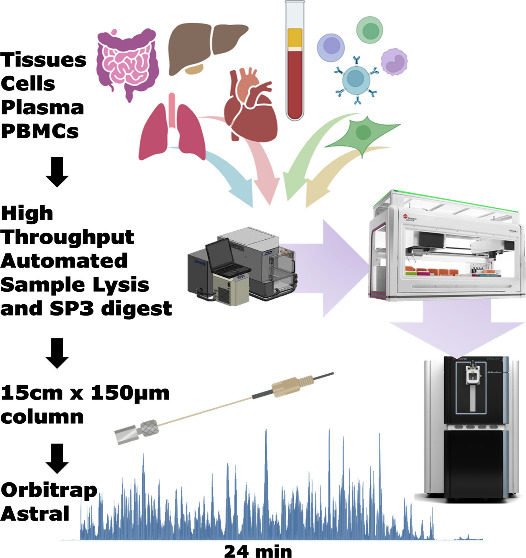

**Background:** High-throughput proteomics has dramatically improved biomedical research, but it came at cost of proteomics depth. The reason being, identifying thousands of proteins requires longer LC gradient times, which limits how many samples can be processed in a clinical or large-cohort setting. Additionally, the choice of data acquisition mode, whether DDA or DIA played an important role in shaping this trade-off. The introduction of the Orbitrap Astral mass spectrometer marked a significant turning point in resolving this trade-off. With the scan speeds up to 200 Hz and a highly parallelizable data acquisition mode, the Astral mass analyzer enables deep proteome coverage at speeds that were previously not achievable. This technical note, published in Journal of Proteome Research and carried out at the Precision Biomarker Laboratories, Cedars-Sinai Medical Center, presents a comprehensive workflow that benchmarks the Orbitrap Astrals performance across three major sample categories: biofluids (plasma, dried blood spots), cells (HeLa, PBMCs, HEK293) and tissues (mouse heart, liver, lung and intestine).

**Methods:**

-   Central to the workflow was automation at every step. For cell and tissue lysis, we leveraged Adaptive focused acoustics (AFA) technology on a Covaris LE220-plus sonicator for efficient and reproducible homogenization in a plate format without manual bead-beating steps. The protein digestion was automated using the SP3 (single-pot, solid-phase-enhanced sample preparation) protocol run on a Beckman i7 automated workstation. Each steps, from bead aliquoting and reduction to alkylation and overnight trypsin digestion was performed entirely on deck for 18 hours at 37 °C and 1200 rpm. Together, these automations significantly reduced human intervention while maximizing reproducibility across samples.

-   Plasma samples were prepared using four different protocol to evaluate how complementary approaches can improve proteome depth in a sample type challenged by an exceptionally high dynamic range (over 10 to 12 orders of magnitude).

    -   naïve or undepleted,

    -   antibody-depleted (Top-14)

    -   perchloric acid (PerCA) precipitated

    -   Seer nanoparticle fractionation

-   The digested peptides samples spanning cells, tissues and plasma prepared using different methods were separated using a 150 μm × 15 cm Evosep column (1.9 μm particle size, PepSep) coupled to the NeoVanquish LC system and analysed in DIA mode on Thermo's Orbitrap Astral mass spectroemter. For each gradient length, two DIA window sizes were compared — a quantitation-optimised larger window (e.g., 3 Th for the 24 min gradient) and a smaller window (e.g., 2 Th) to assess the trade-off between identification depth and quantitative accuracy. The mass spectrometry raw files were searched against the UniProt human and mus musculus reviewed databases using DIA-NN v1.8.1 in library-free mode via in-house bioinformatics platform called ProEpic. To assess both proteome depth and technical reproducibility, a 3×3 study design (three replicates on three separate days) was applied to cells, tissue and biofluid proteome.

{fig-align="center"}

**Results:** The study delivered five notable findings.

-   **Exceptional proteome depth at short gradient times.** For HeLa cell digests, a 200 ng injection run on 45 min gradient covered approximately 90% of the expressed proteome, while an 8 min gradient delivered 78% as many identifications in less than 1/5 of the time. For cells and tissues analysed with a 24 min gradient, protein group identifications consistently exceeded 10,000. Importantly, the depth of coverage extended down to proteins present at approximately 100 copies per cell, with the lowest detected protein estimated at just 13 copies per cell. This level of sensitivity opens up detection of very low-abundance regulatory and signalling proteins that would be missed by less sensitive platforms.

-   **DIA window size trade-offs depend on gradient length.** Smaller DIA windows (2 Th) consistently yielded more protein identifications than larger windows (3 Th) but at the cost of quantitative precision. With a 24 min gradient, the 2 Th window noticeably skewed the CV distribution compared to 3 Th, though average CVs remained below 13% for HeLa cells and 20% for plasma (Fig 1). Importantly, this trade-off was far less pronounced at shorter gradient lengths, with 11 min gradient showed little practical difference between window sizes. This suggests that for high-throughput screening studies where throughput is prioritised, shorter gradients with larger windows offer an excellent balance of speed, depth and reproducibility, while longer gradients with smaller windows are better suited for discovery-focused experiments where maximum identification depth is the priority.

{fig-align="center"}

-   **Quantitative reproducibility is strong, especially at shorter gradients.** The reproducibility across HeLa injections was equally strong as more than 80% of proteins showed a coefficient of variation (CV) below 20%, a widely accepted benchmark for reliable quantification. Interestingly, shorter gradients produced tighter CV distributions than longer ones, likely because faster runs favor sharper chromatographic peaks. In naïve plasma, one of the most challenging sample types in proteomics — a 45-minute gradient still identified over 1,100 proteins with good quantitative precision. Between 91 and 122 FDA-approved circulating biomarkers were detected depending on the sample preparation and gradient length used, the vast majority were below 20% CV threshold (Fig 1). Even in naïve (undepleted) plasma — the most challenging condition — low-abundance markers including Mucin-16 (CA125), pancreatic triacylglycerol lipase (PNLIP) and CD36 were detectable.

-   **Plasma depletion strategies are complementary.** A direct comparison of naïve, antibody-depleted, PerCA-precipitated and Seer nanoparticle-treated plasma revealed that no single method fully overlapped with the others in protein identifications. It was observed that preparations were evidently complementary, each accessing a distinct slice of the plasma proteome (Fig 2). PerCA precipitation delivered over 1,500 identifications, competitive with antibody depletion, at considerably lower cost. The relative cost of these approaches is worth highlighting for cohort design decisions: PerCA \< antibody depletion \< nanoparticle fractionation. For large clinical cohorts where cost per sample is a real constraint, PerCA precipitation offers a practical route to deeper coverage without the expense of nanoparticle-based platforms. Each Seer nanoparticle replicate comprised five injections (one per nanoparticle fraction), an important detail when interpreting the depth figures for that preparation. Beyond plasma, dried blood spots were also included as a biofluid type, extending the workflow's applicability to minimally invasive sample collection formats relevant in clinical and field settings.

{fig-align="center"}

-   **Challenging sample types — PBMCs and cardiac tissue.** For PBMCs, the platform achieved close to 9,000 protein identifications on a 24-minute gradient, representing the most extensive proteome coverage reported for this cell type at this level of throughput. Reactome pathway enrichment of these identifications spanned metabolism, immune response, cell cycle and disease — reflecting the full range of cellular responses that could be interrogated in a high-throughput immunology setting. Cardiac tissue is notoriously difficult to profile deeply because high-abundant sarcomeric myofilament proteins, responsible for the heart's contractile function masks low-abundance species, much albumin does in plasma. Despite this, over 10,000 protein groups were identified across murine tissues when searched together, corresponding to 8,928 unique proteins. Within heart tissue alone, more than 800 of the estimated 1,100–1,400 mitochondrial proteins were identified, demonstrating that the platform can access functionally important low-abundance compartments even in proteomically challenging matrices.

Taken togther, this work establishes a robust, end-to-end platform — from automated sample preparation to deep DIA acquisition — that is practical for translational research at scale. The combination of AFA assisted lysis, automated SP3 digestion and the Orbitrap Astral directly addresses the bottlenecks that have historically limited large-cohort proteomics studies. The window size analysis provides concrete guidance for study design decisions and the plasma depletion comparison gives researchers a cost-aware framework for choosing the right preparation strategies. These findings carry direct implications for biomarker discovery programs where both depth and reproducibility across hundreds of patient samples are essential.

The mass spectrometry data have been deposited in ProteomeXchange under dataset [PXD054015](https://proteomecentral.proteomexchange.org/cgi/GetDataset?ID=PXD054015).

**Full citation:** Hendricks NG, Bhosale SD, Keoseyan AJ, Ortiz J, Stotland A, Seyedmohammad S, Nguyen CDL, Bui JT, Moradian A, Mockus SM, Van Eyk JE. An Inflection Point in High-Throughput Proteomics with Orbitrap Astral: Analysis of Biofluids, Cells, and Tissues. J Proteome Res. 2024;23(9):4163–4169. <https://doi.org/10.1021/acs.jproteome.4c00384>

**Note:** The custom R scripts and associated data frames are freely available at [https://github.com/santoshdbhosale/R_scripts_Proteomics_analysis](https://github.com/santoshdbhosale/R_scripts_Proteomics_analysis.git) and were used to generate the figures presented in the above manuscript.
