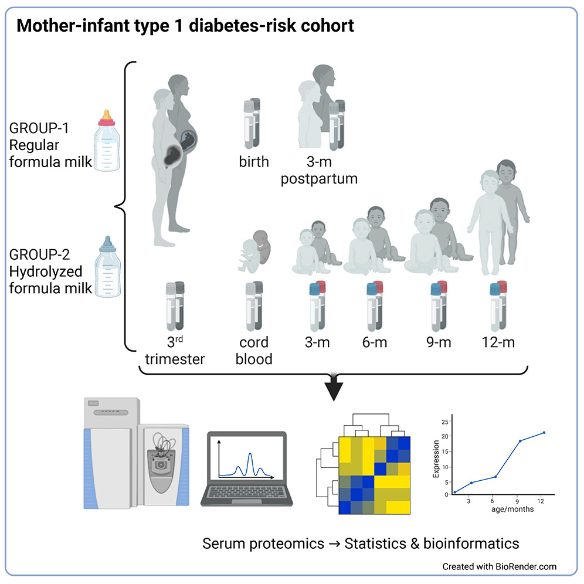

**Background:** Type 1 diabetes (T1D) is an autoimmune disease caused by the progressive destruction of insulin-producing β cells in the pancreas, with the major genetic risk conferred by alleles at the HLA-DRB1 and DQB1 loci. The physiology of the mother during pregnancy and in the infant during early stages of life may be affected by exogenous factors with later implications on the development of the immune system.

**The Early Dietary Intervention and Later Signs of Beta-Cell Autoimmunity study** was conducted to examine that how usage of two different research infant influenced the development of beta-cell autoimmunity. The samples collected in the study included serum from the mother during pregnancy, at and after delivery, and from the children at different time intervals in the first year of life (cord blood, 3, 6, 9 and 12 months). Using a mass spectrometry based proteomics approach we have determine protein expression profiles for the mothers and children samples and evaluated the links between the mother and child, dietary intervention and other metadata.

{fig-align="center"}

**Methods:** Undepleted serum samples (Mother-child pairs) were denatured, reduced and alkylated, and digested with trypsin. The desalted peptides were analysed in randomized batches in triplicate using tandem mass spectrometry (LC-MS/MS) with a label free quantification (LFQ) approach. A Q Exactive Orbitrap mass spectrometer was used in data dependent acquisition mode. The mass spectrometry raw files were searched using MaxQuant to enable the protein identification and quantification. The LFQ data was then analysed using Perseus and R.

**Results:**

The study yielded four main observations:

**Pregnancy-associated changes in the maternal serum proteome.** Clear differences were seen between maternal serum at the third trimester, delivery, and postpartum. Proteins highly specific to pregnancy — including oxytocinase (LNPEP), chorionic somatomammotropin (CSH2), chorionic gonadotrophin subunits and pregnancy-specific glycoproteins (PSGs) — were essentially absent from postpartum samples, reflecting the normal resolution of pregnancy.

**Cord blood has a distinct protein signature.** The cord blood proteome was markedly different from both maternal and later infant samples. Fetal-specific hemoglobins (HBZ, HBG1), alpha-fetoprotein (AFP), prolactin and several collagen proteins were detected predominantly or exclusively in cord blood. Conversely, acute phase proteins such as CRP and SAA2, elevated in mothers at delivery, were absent from cord blood - consistent with the placental barrier maintaining immune separation during healthy deliveries.

**Mother-to-infant protein correlations reveal inherited traits.** Paired correlation analysis of ranked protein intensities within the dyads identified **10 proteins with statistically significant mother-infant correlations (FDR \<0.05)**. These included complement proteins (CFHR1, FCN3), coagulation-related proteins (SERPINA1, FGA, HABP2), immunoglobulin kappa chain proteins, lipopolysaccharide-binding protein (LBP) and APOA2 - reflecting passive immune transfer and potentially inherited complement and coagulation characteristics.

**Serum proteins correlate with intestinal permeability.** Using lactulose-mannitol (L/M) ratio measurements, fibrinogen (FGA) and IGHV3-72 were positively correlated with gut permeability, while GPX3, TFRC and APOF were inversely correlated - suggesting that proteins involved in oxidative stress protection, iron transport and lipid homeostasis may reflect intestinal barrier integrity.

Regarding the dietary intervention, while the hydrolyzed formula did not reduce β cell autoimmunity (as established by the main [TRIGR trial](https://clinicaltrials.gov/study/NCT01735123)), earlier work from this cohort showed it did reduce intestinal permeability. Linear mixed-effects modelling revealed suggestive interactions at 12 months, with GGH, CD14 and APOM trending higher in the hydrolyzed formula group. Notably, APOM is a carrier of sphingosine-1-phosphate (S1P) and is associated with vascular and epithelial integrity - pointing to a potential mechanistic link with the improved gut barrier in the hydrolyzed formula group, though these differences did not survive FDR correction.

This study provides a **unique longitudinal proteomics reference** spanning pregnancy through the first year of life in a T1D-risk cohort. The mother-infant protein correlations highlight biological continuities transferred across this developmental window. Identifying proteins linked to intestinal permeability — particularly TFRC, APOF and GPX3 — could merit further investigation as accessible markers of gut barrier function, which is increasingly recognized as relevant to autoimmune disease risk.

The proteomics data have been deposited in the [PRIDE ProteomeXchange repository (PXD046387)](https://www.ebi.ac.uk/pride/archive/projects/PXD046387) and targeted proteomics data are available at [panoramaweb.org](https://panoramaweb.org/AG0DKm.url).

------------------------------------------------------------------------

**Full citation:** Bhosale SD, Moulder R, Suomi T, Ruohtula T, Honkanen J, Virtanen SM, Ilonen J, Elo LL, Knip M, Lahesmaa R. Serum proteomics of mother-infant dyads carrying HLA-conferred type 1 diabetes risk. *iScience.* 2024;27(6):110048. <https://doi.org/10.1016/j.isci.2024.110048>
