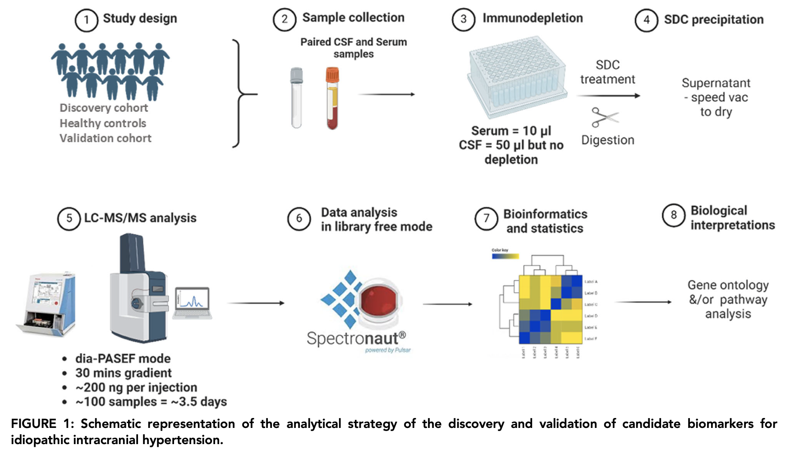
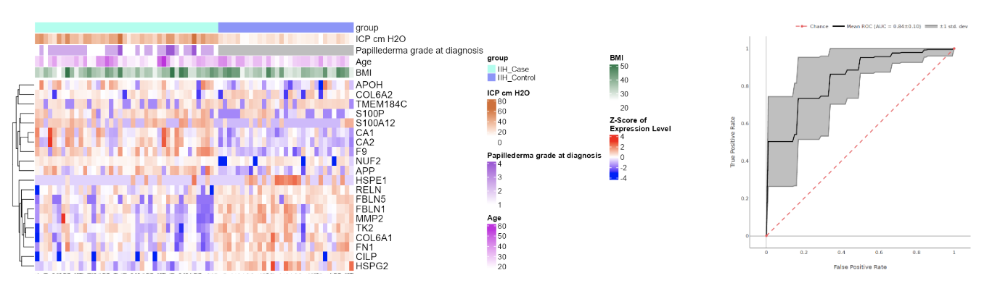
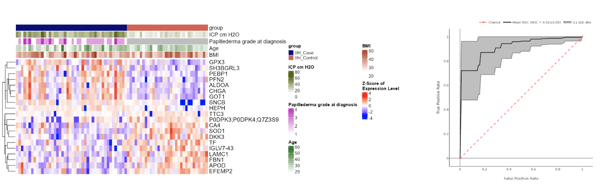
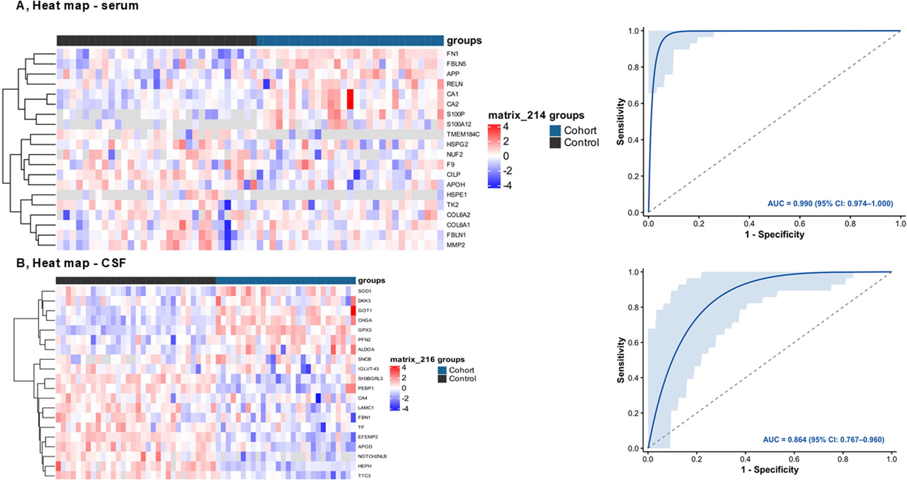
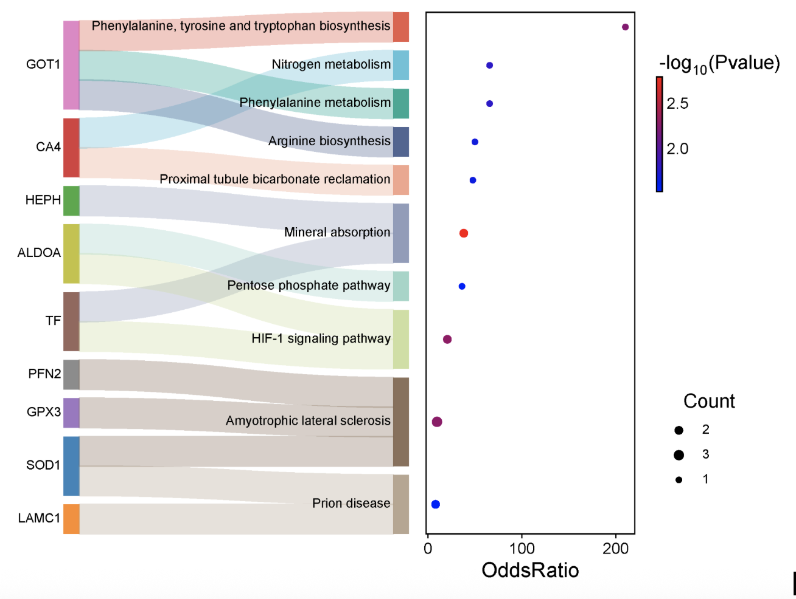
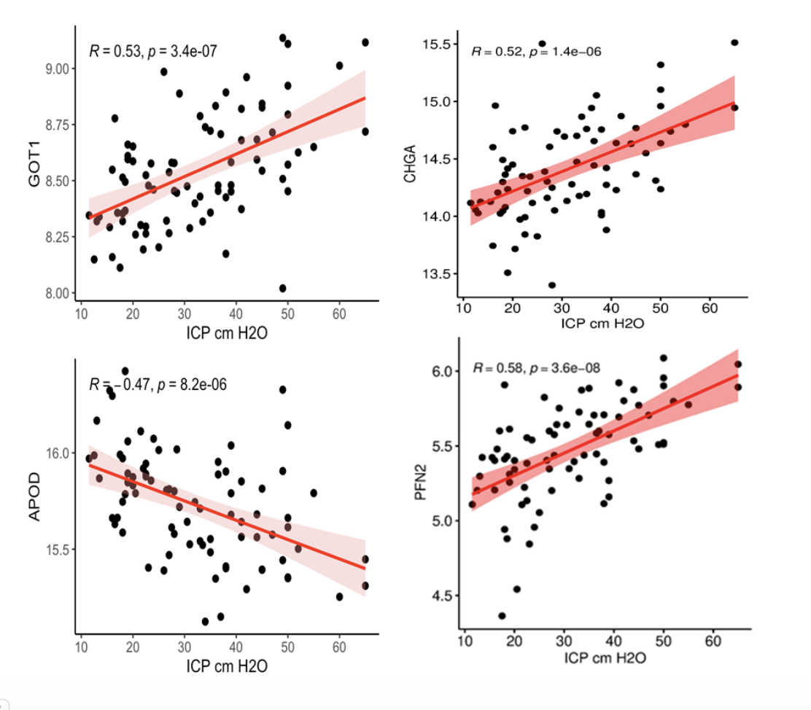

**Background:** Idiopathic intracranial hypertension (IIH) is characterized by increased intracranial pressure (ICP) in or around the brain and it primarily affect obese women of childbearing age and the incidence is increasing due to pandemic obesity. The pathophysiology of IIH is poorly understood and associated with non-specific clinical presentation and shows headache, pulsatile tinnitus and visual disturbances as symptoms occurs in alert and awake patients. Despite being a clinically significant condition, diagnosis still relies on criteria based on intracranial pressure (ICP) related characteristics rather than on disease-specific molecular markers. Biomarkers that could support early diagnosis, help distinguish IIH from mimicking conditions and illuminate the underlying biology are urgently required. Blood-based biomarkers are especially attractive because of their accessibility and ability to carry potential archive of biological information due to its continuous perfusion through body tissues.

Previous proteomics and metabolomics studies in IIH have pointed to roles for the renin–angiotensin system, inflammatory and neuroendocrine proteins, altered glucocorticoid metabolism and dysregulated amino acid and lipid metabolism. However, consistent, reproducible and IIH-specific molecular patterns have remained elusive, partly due to small cohort sizes, heterogeneous control groups, unmatched demographics and the absence of an independent validation.

**Methods:**

This prospective cross-sectional cohort study was conducted at two Danish Headache Centers covering a total population of 3.9 million people. Between January 2018 and August 2021, treatment naïve patients with newly diagnosed, definite IIH were consecutively recruited alongside age, sex and BMI matched healthy controls. Only patients with confirmed IIH at first diagnosis were included; IIH relapse, secondary pseudotumor cerebri syndrome and patients already on acetazolamide treatment were excluded. Paired serum and CSF samples were collected at the time of diagnosis and processed using a high-throughput LC–MS/MS proteomics workflow:

-   **Serum:** High-abundance protein depletion (Top 14) was performed prior to trypsin digestion.
-   **CSF:** directly reduced, alkylated and digested with trypsin without depletion, given the lower dynamic range of CSF compared to serum.
-   Peptides were separated on AURORA ELITE C18 columns (15 cm × 75 µm, 1.6 µm) using a Nano EASY LC 1000 system and analyzed in DIA mode (dia-PASEF) on a timsTOF HT (Bruker) with a \~30-minute gradient.
-   Raw data were processed in Spectronaut using directDIA+ (Deep) mode with cross-run normalization.

Machine learning analysis was performed using [OmicLearn (v1.4)](https://omiclearn.readthedocs.io/en/latest/) with an XGBoost classifier and ExtraTrees feature selection to identify the 20 most IIH-predicting proteins in serum and CSF. A repeated stratified cross-validation approach was used for model training and evaluation.

The discovery cohort findings were validated in three independent cohorts:

-   **Validation cohort 1:** 27 Austrian patients with new-onset IIH from Vienna University Hospital.
-   **Validation (Pseudovalidation) cohort 2:** Patients with cerebral sinus venous thrombosis (pwCSVT; n = 10), a condition that can mimic IIH, with publicly available plasma proteomics data covering 10 of the 20 IIH-predicting serum proteins.
-   **Validation cohort 3:** Patients with normal pressure hydrocephalus (pwNPH; n = 68) and suspected-but-excluded NPH controls (n = 33), whose CSF proteome covered 18 of the 20 IIH-predicting CSF proteins.

**Results:**

A total of 53 Danish patients with new-onset IIH and 35 matched healthy controls were enrolled, with 44 patients and 32 controls included in final CSF proteomics analyses (and 43/31 in serum analyses, after quality criteria analysis). All subjects were female. The three groups, Danish IIH patients, Austrian IIH patients and healthy controls were matched for age (median 28, 32, and 29 years, respectively) and BMI (median 36, 35, and 36 kg/m²). Both IIH groups showed significantly elevated lumbar puncture opening pressure (LPOP) compared to controls (median 38.0 and 34.0 vs. 19.0 cmH₂O; p \< 0.001) and presented with papilledema in all cases.

The LC–MS/MS analysis identified **2,250 proteins in CSF** and **1,289 proteins in serum**, with a 34.8% overlap between the two compartments. The higher dynamic range of serum limited protein identifications despite immunodepletion, a known challenge in serum proteomics.

The study delivered several notable findings:

**Machine learning analysis identified 20 IIH-predicting proteins per biofluid.** Machine learning analysis of the discovery cohort identified 20 top ranking IIH-predicting proteins in serum (AUROC = 0.84) and 20 in CSF (AUROC = 0.92).

Surprisely, there was no overlap between the serum and CSF protein top 20 panels, highlighting that the two biofluids provide complementary and non-redundant biological information about IIH. The candidate biomarkers were validated in Austrian pwIIH with AUROCs of 0.99 (serum) and 0.86 (CSF), likely reflecting the robustness of the identified signature. In contrast, the IIH-predictive protein panels were unable to distinguish pwCSVT (AUROC = 0.63, plasma) or pwNPH (AUROC = 0.67, CSF) from their respective controls, confirming that IIH-specificity of the identified biomarkers.

**Carbonic anhydrases 1 and 2 emerge as key serum biomarkers.** Among the 20 most IIH-predicting serum proteins, carbonic anhydrase 1 (CA1; log₂FC = 1.10, adj.p.value = 0.0002) and carbonic anhydrase 2 (CA2; log₂FC = 1.02, adj.p.value = 4.35×10⁻⁵) were consistently upregulated across both the Danish discovery and Austrian validation cohorts. CA2 is expressed in the choroid plexus and directly catalyzes CSF production. Since patients on acetazolamide, a carbonic anhydrase inhibitor, were excluded from the discovery cohort, this upregulation cannot be attributed to treatment effects and instead points to CA2-driven CSF hypersecretion as a plausible disease mechanism. This finding also provides a molecular rationale for why acetazolamide (CA inhibitor) are effective in IIH.

**Markers of neuronal impairment underscore the non-benign nature of IIH.** Amyloid precursor protein (APP) was upregulated in IIH serum (log₂FC = 0.40, adj.p.value = 0.01). APP is known to be upregulated at sites of axonal injury. S100P and S100A12 were also among the most IIH-predictive serum proteins, both have previously been linked to neuronal apoptosis, traumatic brain injury and poor neurological outcomes after cerebrovascular events.

**The CSF proteome reflects metabolic and energetic dysregulation.** KEGG pathway enrichment of the CSF proteins highlighted altered carbon and amino acid metabolism, disrupted TCA cycle activity and impaired bicarbonate/pH homeostasis, all consistent with previous metabolomics findings in IIH.

The upregulation of glutamic oxaloacetate transaminase 1 (GOT1) and aldolase A (ALDOA), both positioned at the intersection of glycolysis, gluconeogenesis and the TCA cycle, is an indicative of CNS energy metabolism dysfunction. CSF GOT1 levels were also correlated with ICP (Pearson r = 0.53), consistent with its role as a marker of cerebral ischemia and poor neurological outcome in subarachnoid hemorrhage. Chromogranin-A (CHGA) and profilin-2 (PFN2) showed positive correlations with ICP, while apolipoprotein D (APOD) correlated negatively, the latter is of interest given its emerging role in neurodegenerative disorders.

This study identified IIH-specific candidate biomarker panel in paired serum and CSF samples for IIH subjects. The fidelity of identified biomarkers were confirmed in three different validation cohorts. Increased expression of CA2 reveals plausible mechanism towards CSF hypersecreation in IIH, indicating therapeutic efficacy of CA inhibitors.

------------------------------------------------------------------------

**Full citation:** Bhosale SD, Nawrocki A, Korsbæk JJ, Hansen NS, Foettinger F, Krajnc N, Norvig MJ, Eriksen NL, Macher S, Pemp B, Westgate CSJ, Pedersen CB, Poulsen FR, Munthe S, Bsteh G, Larsen MR, Jensen RH, Beier D. Idiopathic Intracranial Hypertension Is Characterized by a Distinct Proteomic Profile. *Annals of Neurology.* 2026. <https://doi.org/10.1002/ana.78261>
