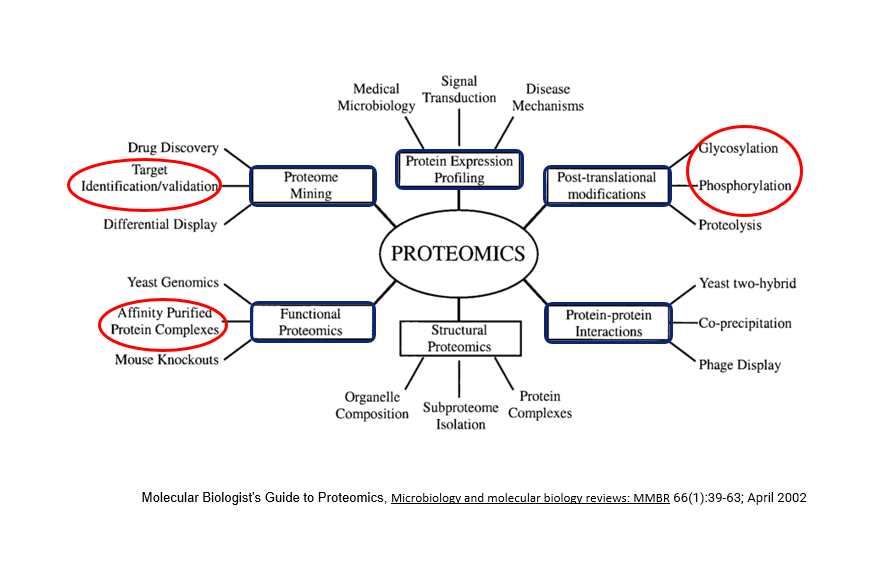

{width=200px fig-align="center"}

Hi, I'm Santosh D. Bhosale, pharmacist by training and using the versatility of mass spectrometry-based proteomics, I explored the properties of biologically important proteins.

Precisely, I worked on mass spectrometry-based proteomics technologies to address the questions related to biomedical research. These includes not only the qualitative and quantitative measurement of proteins, but also their post-translational modifications and interactions with other proteins. I used variety of computational methods to understand the complexity of proteins.



```{=html}
<style>
    .hero-animated {
        position: relative;
        min-height: 70vh;
        display: flex;
        align-items: center;
        justify-content: center;
        background: linear-gradient(135deg, #0f2027 0%, #203a43 50%, #2c5364 100%);
        overflow: hidden;
        margin: 3rem -2rem 2rem -2rem;
        border-radius: 15px;
    }

    .dna-background {
        position: absolute;
        width: 100%;
        height: 100%;
        opacity: 0.1;
    }

    .helix {
        position: absolute;
        width: 4px;
        height: 100%;
        background: linear-gradient(to bottom, transparent, #00d4ff, transparent);
        animation: flow 8s linear infinite;
    }

    .helix:nth-child(1) { left: 20%; animation-delay: 0s; }
    .helix:nth-child(2) { left: 40%; animation-delay: 2s; }
    .helix:nth-child(3) { left: 60%; animation-delay: 4s; }
    .helix:nth-child(4) { left: 80%; animation-delay: 6s; }

    @keyframes flow {
        0% { transform: translateY(-100%); }
        100% { transform: translateY(100%); }
    }

    .particle {
        position: absolute;
        width: 6px;
        height: 6px;
        background: #00d4ff;
        border-radius: 50%;
        animation: float 15s infinite;
        opacity: 0.6;
        box-shadow: 0 0 10px #00d4ff;
    }

    @keyframes float {
        0%, 100% { transform: translate(0, 0) scale(1); opacity: 0; }
        10% { opacity: 0.6; }
        90% { opacity: 0.6; }
        50% { transform: translate(100px, -100px) scale(1.5); }
    }

    .hero-content {
        position: relative;
        z-index: 10;
        text-align: center;
        padding: 2rem;
        max-width: 1200px;
    }

    .hero-content h1 {
        font-size: 3.5rem;
        color: #ffffff;
        margin-bottom: 1rem;
        animation: fadeInUp 1s ease-out;
        font-weight: 700;
        letter-spacing: -1px;
    }

    .title-highlight {
        background: linear-gradient(120deg, #00d4ff, #7b2ff7);
        -webkit-background-clip: text;
        -webkit-text-fill-color: transparent;
        background-clip: text;
        animation: gradientShift 3s ease infinite;
    }

    @keyframes gradientShift {
        0%, 100% { filter: hue-rotate(0deg); }
        50% { filter: hue-rotate(30deg); }
    }

    .hero-content .description {
        font-size: 1.1rem;
        color: #c0d8e0;
        max-width: 800px;
        margin: 0 auto 3rem;
        line-height: 1.8;
        animation: fadeInUp 1s ease-out 0.4s backwards;
    }

    @keyframes fadeInUp {
        from {
            opacity: 0;
            transform: translateY(30px);
        }
        to {
            opacity: 1;
            transform: translateY(0);
        }
    }

    .tech-tags {
        display: flex;
        flex-wrap: wrap;
        gap: 1rem;
        justify-content: center;
        margin-bottom: 3rem;
        animation: fadeInUp 1s ease-out 0.6s backwards;
    }

    .tag {
        padding: 0.7rem 1.5rem;
        background: rgba(0, 212, 255, 0.1);
        border: 2px solid rgba(0, 212, 255, 0.3);
        border-radius: 25px;
        color: #00d4ff;
        font-size: 0.9rem;
        font-weight: 600;
        transition: all 0.3s ease;
        animation: pulse 2s infinite;
    }

    .tag:nth-child(1) { animation-delay: 0s; }
    .tag:nth-child(2) { animation-delay: 0.2s; }
    .tag:nth-child(3) { animation-delay: 0.4s; }
    .tag:nth-child(4) { animation-delay: 0.6s; }
    .tag:nth-child(5) { animation-delay: 0.8s; }
    .tag:nth-child(6) { animation-delay: 1s; }

    @keyframes pulse {
        0%, 100% { 
            box-shadow: 0 0 5px rgba(0, 212, 255, 0.3);
            transform: scale(1);
        }
        50% { 
            box-shadow: 0 0 20px rgba(0, 212, 255, 0.6);
            transform: scale(1.05);
        }
    }

    .tag:hover {
        background: rgba(0, 212, 255, 0.2);
        border-color: #00d4ff;
        box-shadow: 0 0 20px rgba(0, 212, 255, 0.5);
        transform: translateY(-3px);
    }

    @media (max-width: 768px) {
        .hero-animated { min-height: 60vh; }
        .hero-content h1 { font-size: 2rem; }
        .hero-content .description { font-size: 1rem; }
    }
</style>

<div class="hero-animated">
    <div class="dna-background">
        <div class="helix"></div>
        <div class="helix"></div>
        <div class="helix"></div>
        <div class="helix"></div>
    </div>

    <div class="hero-content">
        <h1>Accelerating <span class="title-highlight">Drug Discovery</span><br>with AI & ML</h1>
        
        <p class="description">
            Leading biomarker module development for omics research, leveraging AI/ML approaches to accelerate pharmaceutical innovation. Bridging computational biology and product development through collaborative data science and strategic LLM optimization.
        </p>

        <div class="tech-tags">
            <div class="tag">Biomarker discovery</div>
            <div class="tag">Omics research</div>
            <div class="tag">LLM optimization</div>
            <div class="tag">Data curation</div>
            <div class="tag">Product management</div>
            <div class="tag">AI/ML pipeline</div>
        </div>
    </div>
</div>

<script>
    // Generate floating particles
    const hero = document.querySelector('.hero-animated');
    if (hero) {
        for (let i = 0; i < 30; i++) {
            const particle = document.createElement('div');
            particle.className = 'particle';
            particle.style.left = Math.random() * 100 + '%';
            particle.style.top = Math.random() * 100 + '%';
            particle.style.animationDelay = Math.random() * 15 + 's';
            particle.style.animationDuration = (10 + Math.random() * 10) + 's';
            hero.appendChild(particle);
        }
    }
</script>
```