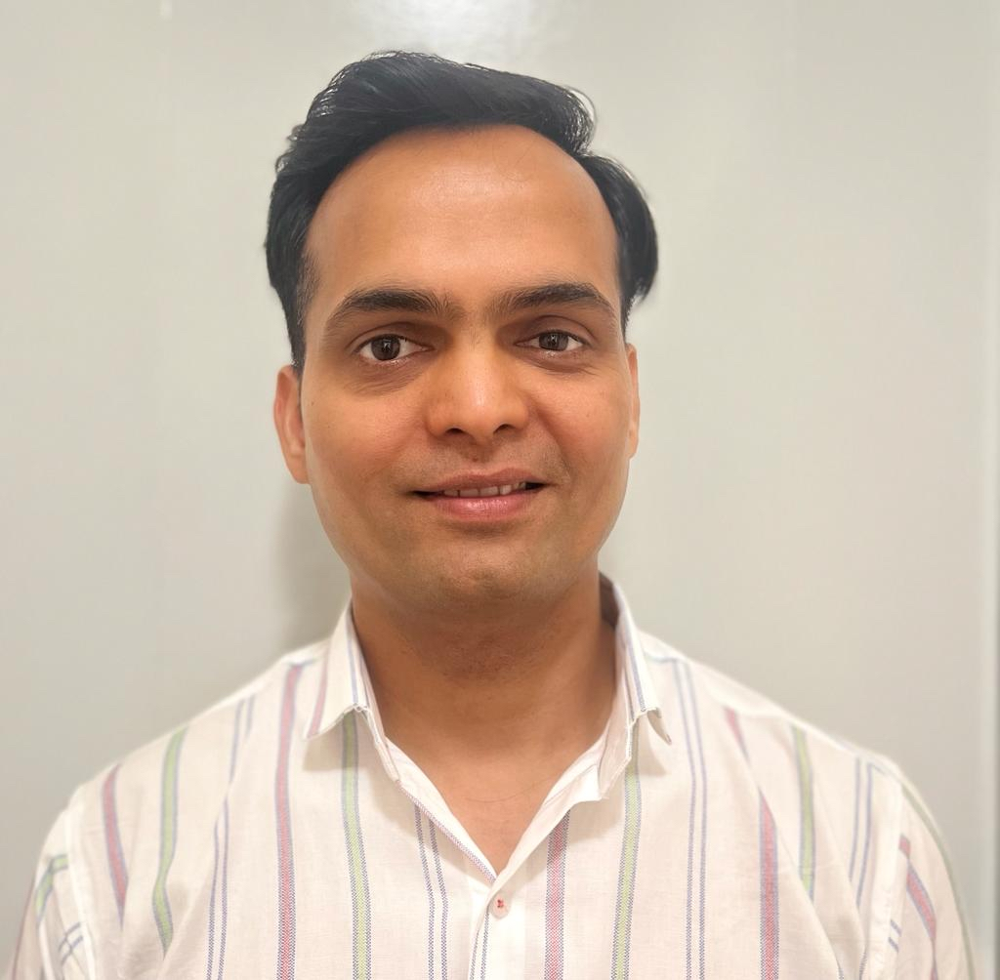
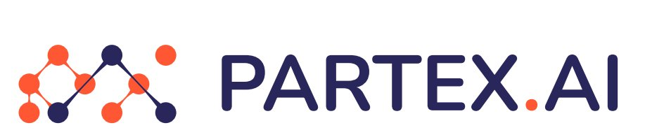
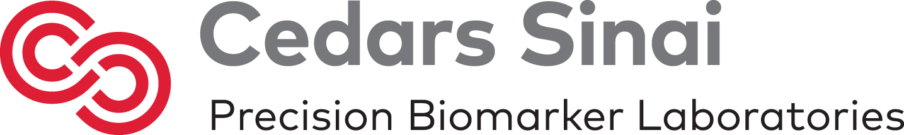
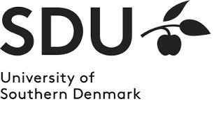
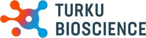
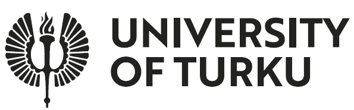

```{=html}
<style>
  :root {
    --ink:        #1a1a2e;
    --ink-muted:  #4a4a6a;
    --ink-light:  #8888aa;
    --surface:    #f8f7f4;
    --surface-2:  #f0ede8;
    --white:      #ffffff;
    --accent:     #2563eb;
    --accent-warm:#e05c1a;
    --green:      #16a34a;
    --border:     rgba(26,26,46,0.09);
    --serif:      'DM Serif Display', Georgia, serif;
    --sans:       'DM Sans', system-ui, sans-serif;
  }

  body { font-family: var(--sans); color: var(--ink); background: var(--surface); }
  #quarto-content { padding: 0 !important; }
  .page-columns { display: block !important; }
  h1.title, .quarto-title { display: none !important; }

  /* ── NAVBAR OVERRIDES ── */
  .navbar {
    background: rgba(248,247,244,0.94) !important;
    backdrop-filter: blur(14px) !important;
    -webkit-backdrop-filter: blur(14px) !important;
    border-bottom: 1px solid rgba(26,26,46,0.08) !important;
    box-shadow: 0 1px 0 rgba(26,26,46,0.04) !important;
  }
  .navbar-brand {
    font-family: var(--serif) !important;
    font-size: 1.05rem !important;
    color: var(--ink) !important;
    font-weight: 400 !important;
  }
  .navbar .nav-link {
    font-size: 0.85rem !important;
    font-weight: 500 !important;
    color: var(--ink-muted) !important;
    border-radius: 6px;
    transition: color 0.15s, background 0.15s !important;
  }
  .navbar .nav-link:hover {
    color: var(--ink) !important;
    background: rgba(26,26,46,0.05) !important;
    text-decoration: none !important;
  }
  .navbar-nav.ms-auto .nav-link {
    color: #aaaacc !important;
    font-size: 1rem !important;
  }
  .navbar-nav.ms-auto .nav-link:hover {
    color: var(--accent) !important;
    background: rgba(37,99,235,0.07) !important;
  }
  .dropdown-menu {
    border: 1px solid rgba(26,26,46,0.1) !important;
    border-radius: 10px !important;
    box-shadow: 0 8px 32px rgba(26,26,46,0.12) !important;
    padding: 0.4rem !important;
  }
  .dropdown-item {
    border-radius: 6px !important;
    font-size: 0.84rem !important;
    color: var(--ink-muted) !important;
    padding: 0.45rem 0.85rem !important;
  }
  .dropdown-item:hover {
    background: rgba(37,99,235,0.07) !important;
    color: var(--ink) !important;
  }

  .sdb-home {
    max-width: 880px;
    margin: 0 auto;
    padding: 3.5rem 1.5rem 6rem;
  }

  /* ── HERO ── */
  .hero {
    display: grid !important;
    grid-template-columns: 140px 1fr !important;
    gap: 2.5rem !important;
    align-items: center !important;
    margin-bottom: 2rem;
    padding-bottom: 2.5rem;
    border-bottom: 1px solid var(--border);
  }
  @media (max-width: 560px) {
    .hero { grid-template-columns: 1fr; text-align: center; }
    .hero-photo { margin: 0 auto; }
  }
  .hero-photo {
    width: 140px; height: 140px;
    border-radius: 50%;
    overflow: hidden;
    border: 3px solid var(--surface-2);
    box-shadow: 0 8px 28px rgba(26,26,46,0.13);
    flex-shrink: 0;
  }
  .hero-photo img { width: 100%; height: 100%; object-fit: cover; object-position: top center; }

  .hero-eyebrow {
    font-size: 0.68rem !important;
    font-weight: 700 !important;
    letter-spacing: 0.18em !important;
    text-transform: uppercase !important;
    color: var(--accent) !important;
    margin: 0 0 0.6rem !important;
    display: block !important;
  }
  .hero-name {
    font-family: var(--serif);
    font-size: 2.3rem;
    line-height: 1.1;
    color: var(--ink);
    margin: 0 0 0.4rem;
  }
  .hero-role {
    font-size: 0.88rem;
    color: var(--ink-light);
    font-weight: 500;
    margin: 0 0 0.9rem;
    letter-spacing: 0.01em;
  }
  .hero-bio {
    font-size: 0.97rem;
    color: var(--ink-muted);
    line-height: 1.8;
    margin: 0 0 1.2rem;
    max-width: 540px;
  }
  .hero-ctas {
    display: flex;
    gap: 0.75rem;
    flex-wrap: wrap;
    margin-top: 0.25rem;
  }
  .btn-primary-sm {
    display: inline-flex;
    align-items: center;
    gap: 0.35rem;
    background: var(--accent);
    color: white !important;
    font-size: 0.8rem;
    font-weight: 600;
    padding: 0.5rem 1.1rem;
    border-radius: 8px;
    text-decoration: none !important;
    transition: background 0.18s, transform 0.15s, box-shadow 0.15s;
    letter-spacing: 0.01em;
  }
  .btn-primary-sm:hover {
    background: #1d4ed8;
    transform: translateY(-1px);
    box-shadow: 0 4px 14px rgba(37,99,235,0.3);
  }
  .btn-secondary-sm {
    display: inline-flex;
    align-items: center;
    gap: 0.35rem;
    background: var(--white);
    color: var(--ink) !important;
    font-size: 0.8rem;
    font-weight: 600;
    padding: 0.5rem 1.1rem;
    border-radius: 8px;
    border: 1px solid rgba(26,26,46,0.14);
    text-decoration: none !important;
    transition: background 0.18s, border-color 0.18s, transform 0.15s;
    letter-spacing: 0.01em;
  }
  .btn-secondary-sm:hover {
    background: var(--surface-2);
    border-color: rgba(26,26,46,0.22);
    transform: translateY(-1px);
  }

  /* ── CURRENTLY ── */
  .currently {
    display: flex;
    align-items: flex-start;
    gap: 0.85rem;
    background: linear-gradient(135deg, #eff6ff, #dbeafe);
    border: 1.5px solid #bfdbfe;
    border-radius: 14px;
    padding: 1.1rem 1.5rem;
    margin-bottom: 2.5rem;
    font-size: 0.92rem;
    color: #1e40af;
    line-height: 1.7;
  }
  .c-dot {
    width: 9px !important;
    height: 9px !important;
    min-width: 9px !important;
    min-height: 9px !important;
    border-radius: 50% !important;
    background: #2563eb !important;
    flex-shrink: 0 !important;
    margin-top: 0.42rem !important;
    display: inline-block !important;
    box-shadow: 0 0 0 3px rgba(37,99,235,0.2);
    animation: pulseblue 2.2s infinite;
  }
  @keyframes pulseblue {
    0%,100% { box-shadow: 0 0 0 3px rgba(37,99,235,0.2); }
    50%      { box-shadow: 0 0 0 7px rgba(37,99,235,0.05); }
  }

  /* ── STATS ── */
  .stats {
    display: grid;
    grid-template-columns: repeat(4, 1fr);
    gap: 0.9rem;
    margin-bottom: 4rem;
  }
  @media (max-width: 560px) { .stats { grid-template-columns: repeat(2,1fr); } }
  .stat-card {
    background: var(--white);
    border: 1px solid var(--border);
    border-radius: 14px;
    padding: 1.25rem 1rem;
    text-align: center;
    transition: box-shadow 0.18s, transform 0.18s;
  }
  .stat-card:hover {
    box-shadow: 0 4px 16px rgba(26,26,46,0.07);
    transform: translateY(-2px);
  }
  .stat-num {
    font-family: var(--serif);
    font-size: 2.1rem;
    color: var(--accent);
    display: block;
    line-height: 1;
    margin-bottom: 0.35rem;
  }
  .stat-lbl {
    font-size: 0.7rem;
    color: var(--ink-light);
    text-transform: uppercase;
    letter-spacing: 0.09em;
    font-weight: 600;
  }

  /* ── SECTION LABELS ── */
  .sec-label {
    font-size: 0.7rem;
    font-weight: 600;
    letter-spacing: 0.16em;
    text-transform: uppercase;
    color: var(--accent);
    margin: 0 0 0.5rem;
    display: flex;
    align-items: center;
    gap: 0.6rem;
  }
  .sec-label::after {
    content: '';
    display: block;
    width: 28px;
    height: 1.5px;
    background: var(--accent);
    border-radius: 2px;
    opacity: 0.5;
  }
  .sec-title {
    font-family: var(--serif);
    font-size: 1.85rem;
    color: var(--ink);
    margin: 0 0 1.5rem;
    line-height: 1.2;
  }

  /* ── EXPERTISE ── */
  .expertise { margin-bottom: 4rem; }
  .expertise-grid {
    display: grid;
    grid-template-columns: repeat(3, 1fr);
    gap: 1rem;
  }
  @media (max-width: 600px) { .expertise-grid { grid-template-columns: 1fr; } }
  .exp-card {
    background: var(--white);
    border: 1px solid var(--border);
    border-radius: 14px;
    padding: 1.5rem 1.4rem;
    transition: box-shadow 0.18s, transform 0.18s, border-color 0.18s;
  }
  .exp-card:hover {
    box-shadow: 0 6px 24px rgba(26,26,46,0.08);
    transform: translateY(-2px);
    border-color: rgba(37,99,235,0.2);
  }
  .exp-icon { font-size: 1.6rem; margin-bottom: 0.7rem; display: block; }
  .exp-title {
    font-weight: 600;
    font-size: 0.92rem;
    color: var(--ink);
    margin-bottom: 0.5rem;
    line-height: 1.3;
  }
  .exp-desc {
    font-size: 0.84rem;
    color: var(--ink-muted);
    line-height: 1.7;
  }
  .exp-tags {
    display: flex;
    flex-wrap: wrap;
    gap: 0.35rem;
    margin-top: 0.85rem;
  }
  .exp-tag {
    font-size: 0.68rem;
    font-weight: 500;
    background: var(--surface-2);
    color: var(--ink-light);
    padding: 0.2rem 0.6rem;
    border-radius: 99px;
    letter-spacing: 0.03em;
  }

  /* ── CAREER TABLE ── */
  .career { margin-bottom: 4rem; }
  .career-table {
    width: 100%;
    border-collapse: collapse;
    background: var(--white);
    border-radius: 14px;
    overflow: hidden;
    border: 1px solid var(--border);
    font-size: 0.88rem;
  }
  .career-table thead tr { background: var(--surface-2); }
  .career-table th {
    font-size: 0.68rem;
    font-weight: 700;
    letter-spacing: 0.13em;
    text-transform: uppercase;
    color: var(--ink-light);
    padding: 0.85rem 1.3rem;
    text-align: left;
  }
  .career-table td {
    padding: 0.9rem 1.3rem;
    color: var(--ink-muted);
    border-top: 1px solid var(--border);
    vertical-align: middle;
    line-height: 1.5;
  }
  .career-table th:nth-child(3),
  .career-table td:nth-child(3) { width: 240px; }
  .career-table tr:hover td { background: #fafaf8; }
  .career-table .year-cell {
    color: var(--accent);
    font-weight: 600;
    white-space: nowrap;
    font-size: 0.83rem;
  }
  .career-table .role-cell {
    font-weight: 600;
    color: var(--ink);
    font-size: 0.88rem;
  }
  .current-row td {
    background: rgba(37,99,235,0.025);
  }
  .current-row .role-cell::after {
    content: ' ✦';
    font-size: 0.55rem;
    color: var(--accent);
    vertical-align: super;
  }

  /* ── PUBLICATIONS ── */
  .publications { margin-bottom: 4rem; }
  .pub-list { display: flex; flex-direction: column; gap: 0.75rem; }
  .pub-card {
    background: var(--white);
    border: 1px solid var(--border);
    border-radius: 12px;
    padding: 1.1rem 1.3rem;
    display: grid;
    grid-template-columns: 52px 1fr auto;
    gap: 1rem;
    align-items: start;
    transition: border-color 0.18s, box-shadow 0.18s;
  }
  .pub-card:hover {
    border-color: rgba(37,99,235,0.25);
    box-shadow: 0 3px 12px rgba(26,26,46,0.05);
  }
  .pub-year {
    font-family: var(--serif);
    font-size: 1.05rem;
    color: var(--accent);
    font-weight: 700;
    padding-top: 0.1rem;
  }
  .pub-title {
    font-size: 0.89rem;
    font-weight: 600;
    color: var(--ink);
    margin-bottom: 0.28rem;
    line-height: 1.45;
  }
  .pub-authors {
    font-size: 0.79rem;
    color: var(--ink-light);
    font-style: italic;
  }
  .pub-badge {
    font-size: 0.68rem;
    font-weight: 600;
    padding: 0.2rem 0.6rem;
    border-radius: 99px;
    white-space: nowrap;
    align-self: center;
    letter-spacing: 0.04em;
  }
  .badge-technology { background: #f3e8ff; color: #6d28d9; }
  .badge-clinical    { background: #dbeafe; color: #1d4ed8; }
  .badge-methods     { background: #dcfce7; color: #15803d; }
  .badge-biomarkers  { background: #fff7ed; color: #c2410c; }

  .view-all {
    display: inline-flex;
    align-items: center;
    gap: 0.3rem;
    margin-top: 1.3rem;
    font-size: 0.85rem;
    font-weight: 600;
    color: var(--accent);
    text-decoration: none;
    transition: gap 0.18s;
  }
  .view-all:hover { gap: 0.5rem; text-decoration: none; }

  /* ── AWARDS ── */
  .awards { margin-bottom: 4rem; }
  .awards-grid {
    display: grid;
    grid-template-columns: repeat(2, 1fr);
    gap: 0.85rem;
  }
  @media (max-width: 560px) { .awards-grid { grid-template-columns: 1fr; } }
  .award-card {
    background: var(--white);
    border: 1px solid var(--border);
    border-radius: 12px;
    padding: 1.1rem 1.3rem;
    display: flex;
    gap: 0.9rem;
    align-items: flex-start;
    transition: box-shadow 0.18s, transform 0.18s;
  }
  .award-card:hover {
    box-shadow: 0 4px 16px rgba(26,26,46,0.07);
    transform: translateY(-1px);
  }
  .award-icon { font-size: 1.25rem; flex-shrink: 0; margin-top: 0.08rem; }
  .award-title {
    font-size: 0.88rem;
    font-weight: 600;
    color: var(--ink);
    margin-bottom: 0.25rem;
    line-height: 1.4;
  }
  .award-detail {
    font-size: 0.77rem;
    color: var(--accent);
    font-weight: 500;
  }

  /* ── INSTITUTION LOGOS ── */
  .org-cell { display: flex; align-items: center; justify-content: flex-start; min-height: 50px; }
  .org-logo { width: auto; object-fit: contain; display: block; flex-shrink: 0; }
  .logo-partex { height: 28px; max-width: 150px; }
  .logo-pbl    { height: 40px; max-width: 200px; }
  .logo-sdu    { height: 50px; max-width: 95px; }
  .logo-btk    { height: 36px; max-width: 145px; }
  .logo-utu    { height: 36px; max-width: 130px; }

  @keyframes pulsegreen {
    0%,100% { box-shadow: 0 0 0 3px rgba(22,163,74,0.2); }
    50%      { box-shadow: 0 0 0 7px rgba(22,163,74,0.05); }
  }
</style>

<div class="sdb-home">

  <!-- ── HERO ── -->
  <div class="hero">
    <div class="hero-photo">
      
    </div>
    <div>
      <h1 class="hero-name">Santosh D. Bhosale</h1>
      <p class="hero-role">Product Manager I &nbsp;·&nbsp; Proteomics Scientist &nbsp;·&nbsp; AI/ML Drug Discovery</p>
      <p class="hero-bio">
        A <strong>pharmacist-turned-proteomics scientist</strong> with a PhD and 15+ years spanning wet-lab mass spectrometry, computational proteomics, and AI/ML for drug discovery. Bridging deep domain biology with scalable data pipelines.
      </p>
      <div class="hero-ctas">
        <a href="cv/index.html" class="btn-primary-sm">View CV →</a>
        <a href="about/index.html" class="btn-secondary-sm">About Me →</a>
      </div>
    </div>
  </div>

  <!-- ── CURRENTLY ── -->
  <div class="currently">
    <div class="c-dot"></div>
    <div>
      <strong>Currently:</strong> Product Manager I (Growth) at <strong>Partex.ai (formerly Innoplexus), Pune</strong> — Spearheading a biomarker discovery module powered by omics data and Llama &amp; Gemini LLMs, accelerating indication prioritisation, drug-target identification, and explainable clinical trial outcome prediction.
    </div>
  </div>

  <!-- ── STATS ── -->
  <div class="stats">
    <div class="stat-card">
      <span class="stat-num">15+</span>
      <span class="stat-lbl">Years Research</span>
    </div>
    <div class="stat-card">
      <span class="stat-num">20+</span>
      <span class="stat-lbl">Publications</span>
    </div>
    <div class="stat-card">
      <span class="stat-num">1</span>
      <span class="stat-lbl">Patent EU &amp; USA</span>
    </div>
    <div class="stat-card">
      <span class="stat-num">2×</span>
      <span class="stat-lbl">Dissertation Awards</span>
    </div>
  </div>

  <!-- ── EXPERTISE ── -->
  <div class="expertise">
    <p class="sec-label">What I Do</p>
    <h2 class="sec-title">Proteomics Meets Artificial Intelligence</h2>
    <div class="expertise-grid">
      <div class="exp-card">
        <span class="exp-icon">🔬</span>
        <div class="exp-title">Proteomics Research</div>
        <div class="exp-desc">Mass spectrometry-based proteomics (DIA/DDA), PTM enrichment (phospho, glyco, cysteine), biomarker discovery from serum/plasma, label-free &amp; isobaric quantification.</div>
        <div class="exp-tags">
          <span class="exp-tag">LC-MS/MS</span>
          <span class="exp-tag">TMT/iTRAQ</span>
          <span class="exp-tag">PTM Analysis</span>
          <span class="exp-tag">DIA/DDA</span>
        </div>
      </div>
      <div class="exp-card">
        <span class="exp-icon">🤖</span>
        <div class="exp-title">AI/ML for Drug Discovery</div>
        <div class="exp-desc">LLM-based data extraction (Llama, Gemini, Claude) from ClinicalTrials.gov &amp; PubChem, Python automation for biocuration, ML pipeline development, agile collaboration with data engineers.</div>
        <div class="exp-tags">
          <span class="exp-tag">Llama</span>
          <span class="exp-tag">Gemini</span>
          <span class="exp-tag">Python</span>
          <span class="exp-tag">Biocuration</span>
        </div>
      </div>
      <div class="exp-card">
        <span class="exp-icon">📦</span>
        <div class="exp-title">Product &amp; Project Management</div>
        <div class="exp-desc">Developing biomarker module that underpins target identification, indication prioritisation, and clinical trial prediction, stakeholder management.</div>
        <div class="exp-tags">
          <span class="exp-tag">Product Mgmt</span>
          <span class="exp-tag">SOW Delivery</span>
          <span class="exp-tag">Stakeholders</span>
        </div>
      </div>
    </div>
  </div>

  <!-- ── CAREER ── -->
  <div class="career">
    <p class="sec-label">Experience</p>
    <h2 class="sec-title">Career Highlights</h2>
    <table class="career-table">
      <thead>
        <tr>
          <th>Period</th>
          <th>Role</th>
          <th>Organisation</th>
          <th>Location</th>
        </tr>
      </thead>
      <tbody>
        <tr class="current-row">
          <td class="year-cell">2025–present</td>
          <td class="role-cell">Product Manager I – Growth</td>
          <td><div class="org-cell"></div></td>
          <td>Pune, India</td>
        </tr>
        <tr>
          <td class="year-cell">2024</td>
          <td class="role-cell">Associate Scientific Manager</td>
          <td><div class="org-cell"></div></td>
          <td>Pune, India</td>
        </tr>
        <tr>
          <td class="year-cell">2023–2024</td>
          <td class="role-cell">Associate Biomedical Scientist</td>
          <td><div class="org-cell"></div></td>
          <td>Los Angeles, USA</td>
        </tr>
        <tr>
          <td class="year-cell">2020–2022</td>
          <td class="role-cell">Postdoctoral Researcher</td>
          <td><div class="org-cell"></div></td>
          <td>Odense, Denmark</td>
        </tr>
        <tr>
          <td class="year-cell">2018–2019</td>
          <td class="role-cell">Postdoctoral Researcher</td>
          <td><div class="org-cell"></div></td>
          <td>Turku, Finland</td>
        </tr>
        <tr>
          <td class="year-cell">2012–2018</td>
          <td class="role-cell">PhD Researcher</td>
          <td><div class="org-cell"></div></td>
          <td>Turku, Finland</td>
        </tr>
      </tbody>
    </table>
  </div>

  <!-- ── PUBLICATIONS ── -->
  <div class="publications">
    <p class="sec-label">Research Output</p>
    <h2 class="sec-title">Selected Publications</h2>
    <div class="pub-list">
      <div class="pub-card">
        <div class="pub-year">2024</div>
        <div>
          <div class="pub-title">An Inflection Point in High-Throughput Proteomics with Orbitrap Astral: Analysis of Biofluids, Cells, and Tissues</div>
          <div class="pub-authors">Hendricks NG, Bhosale SD, et al. · J Proteome Res</div>
        </div>
        <span class="pub-badge badge-technology">Technology</span>
      </div>
      <div class="pub-card">
        <div class="pub-year">2024</div>
        <div>
          <div class="pub-title">Serum proteomics of mother-infant dyads carrying HLA-conferred type 1 diabetes risk</div>
          <div class="pub-authors">Bhosale SD, Moulder R, et al. · iScience</div>
        </div>
        <span class="pub-badge badge-clinical">Clinical</span>
      </div>
      <div class="pub-card">
        <div class="pub-year">2018</div>
        <div>
          <div class="pub-title">Analysis of the plasma proteome using iTRAQ and TMT-based isobaric labeling</div>
          <div class="pub-authors">Moulder R, Bhosale SD, et al. · Mass Spectrometry Reviews</div>
        </div>
        <span class="pub-badge badge-methods">Methods</span>
      </div>
      <div class="pub-card">
        <div class="pub-year">2018</div>
        <div>
          <div class="pub-title">Serum Proteomic Profiling to Identify Biomarkers of Premature Carotid Atherosclerosis</div>
          <div class="pub-authors">Bhosale SD, Moulder R, et al. · Sci Rep</div>
        </div>
        <span class="pub-badge badge-biomarkers">Biomarkers</span>
      </div>
      <div class="pub-card">
        <div class="pub-year">2015</div>
        <div>
          <div class="pub-title">Serum proteomes distinguish children developing type 1 diabetes in a cohort with HLA-conferred susceptibility</div>
          <div class="pub-authors">Moulder R, Bhosale SD, et al. · Diabetes</div>
        </div>
        <span class="pub-badge badge-biomarkers">Biomarkers</span>
      </div>
    </div>
    <a href="cv/index.html" class="view-all">View all 20+ publications and patent →</a>
  </div>

  <!-- ── AWARDS ── -->
  <div class="awards">
    <p class="sec-label">Recognition</p>
    <h2 class="sec-title">Awards &amp; Grants</h2>
    <div class="awards-grid">
      <div class="award-card">
        <div class="award-icon">🏆</div>
        <div>
          <div class="award-title">Doctoral Dissertation Award — Orion Pharma</div>
          <div class="award-detail">€5,000 · 2018</div>
        </div>
      </div>
      <div class="award-card">
        <div class="award-icon">🏆</div>
        <div>
          <div class="award-title">Doctoral Dissertation Award — Maud Kuistila Memorial Foundation</div>
          <div class="award-detail">€5,000 · 2018</div>
        </div>
      </div>
      <div class="award-card">
        <div class="award-icon">🎓</div>
        <div>
          <div class="award-title">Research Grant — Hospital District of Southwest Finland &amp; Turku City</div>
          <div class="award-detail">€3,500 · 2014</div>
        </div>
      </div>
      <div class="award-card">
        <div class="award-icon">✈️</div>
        <div>
          <div class="award-title">Travel Grant — ETH Zürich Proteomics Course</div>
          <div class="award-detail">€500 · 2015 · Turku Centre for Systems Biology</div>
        </div>
      </div>
      <div class="award-card">
        <div class="award-icon">🥇</div>
        <div>
          <div class="award-title">Dr. Ashok B. Vaidya Prize — 1st Place, SAACCP Oral Session</div>
          <div class="award-detail">2009</div>
        </div>
      </div>
    </div>
  </div>


</div>
```
